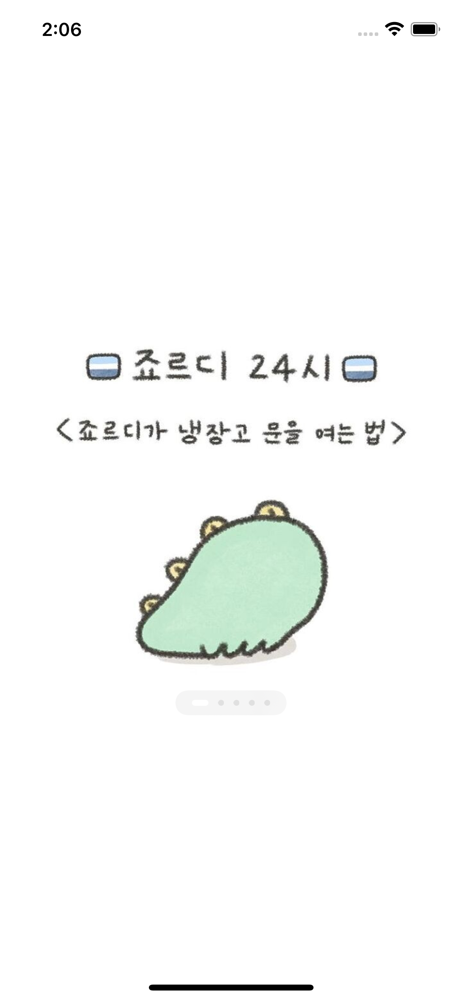

# ToStudy_iOS

> 무한롤링배너 만들기 (2021.01.12 - )

##### [무한롤링배너 브랜치](https://github.com/dely2p/ToStudy_iOS/tree/infinite_rolling_banner)

- 내맘대로 요구사항
	- 우측 방향으로 자동 롤링 되는 배너를 만들고 싶어요.
	- 자동 롤링 시간은 한 5초 정도?	
	- 맨 마지막 이미지가 되면 자동으로 첫 이미지로 계속 돌아가도록이요.
	- 이미지는 현재 5장이구요 로컬에서 관리하기로 할게요.
	- 음.. 배너 하단 가운데쯤에 인디케이터도 있으면 좋을 것 같아요.
	- 아 배너 인디케이터 디자인은 추후 디자인해서 드릴게요.

- 구현사항(개발 시 추가)
	- 기본 컬렉션 뷰 개발	
	- 무한 롤링 기능 추가
	- Page Control 추가 (커스텀)

###### (추가 구현 예정 사항: 이미지로 설정된 Page Indicator 의 색깔 설정하기)

--

> 상단 탭바 고정 스크롤 뷰 만들기 (2021.01.24 - )

- 내맘대로 요구사항
	- 스크롤이 되는 뷰인데요.
	- 제일 위쪽에 이미지 영역이 있고, 바로 밑에 상단탭이 있고, 
	- 그 밑에 상단탭에 따른 콘텐츠가 있어요
	- 상단탭이 톡 하고 위에 붙은 상태에서 하단 콘텐츠를 스크롤 할 수 있게 해주세요.
	- 상단 탭을 탭하거나 콘텐츠 영역 가로스크롤 시 이동(상단탭과 콘텐츠 연동)

- 구현사항(개발 시 추가)
	- 기본 스크롤뷰, 컬렉션뷰, 컨테이너뷰 추가

